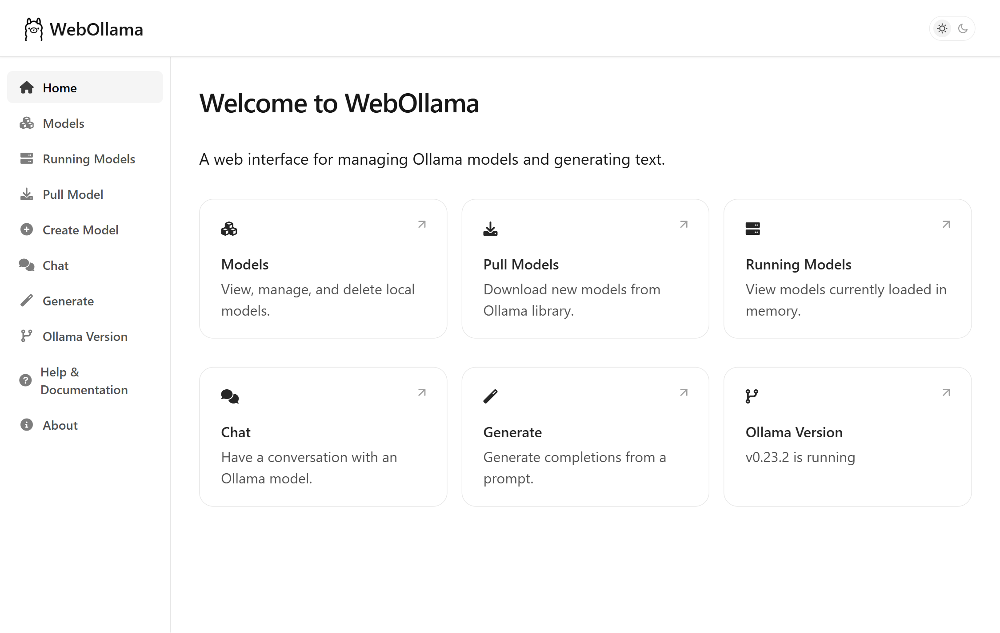
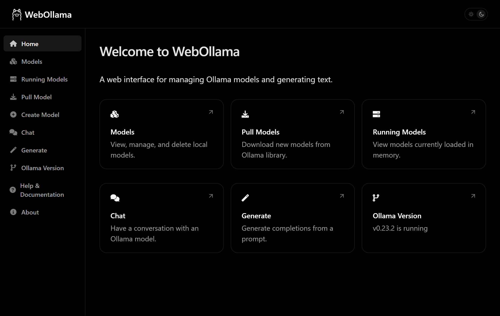
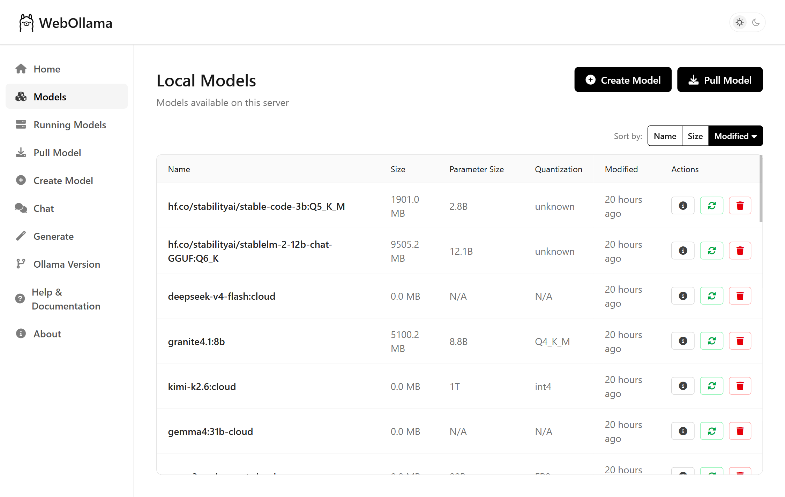
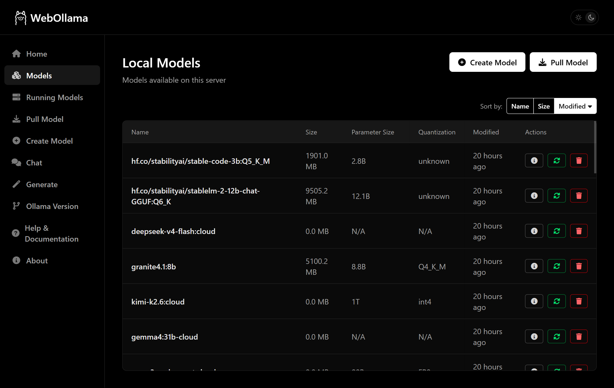
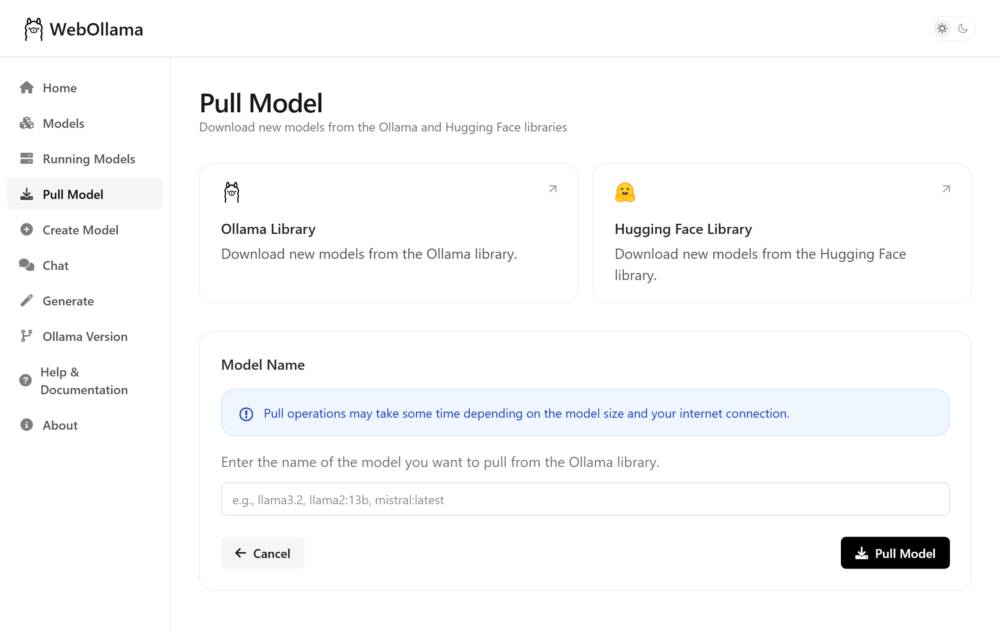
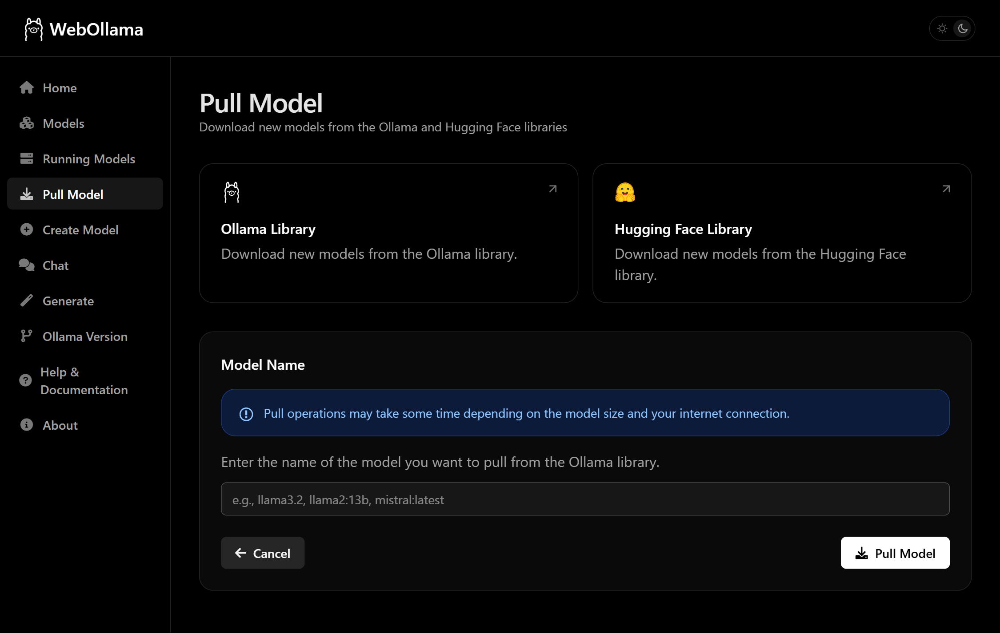
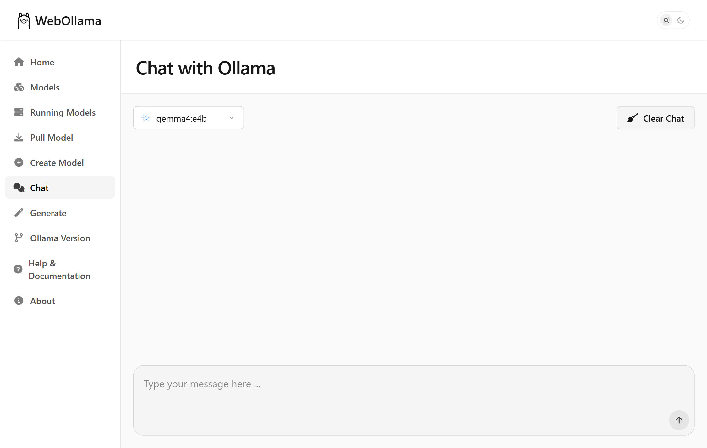
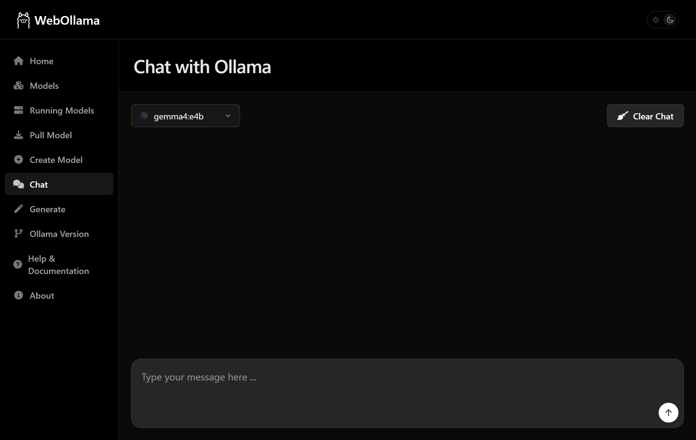
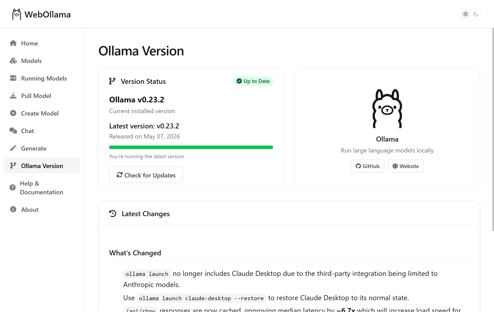
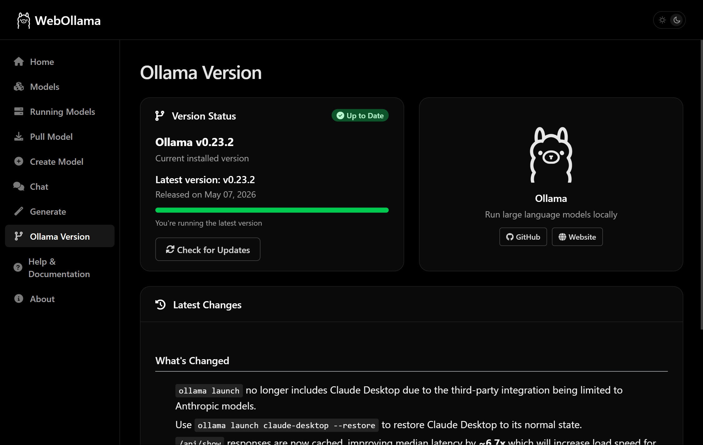

<div align="center">

# WebOllama

**A polished web interface for [Ollama](https://ollama.com/) - manage models, chat, and generate text from your browser.**

[](LICENSE) [](https://www.python.org/) [](https://flask.palletsprojects.com/) [](https://www.docker.com/) [](https://github.com/dkruyt/webollama/pkgs/container/webollama)

Built with Flask and Tailwind CSS. Styled to feel at home alongside the official [Ollama](https://ollama.com/) and [Ollama Docs](https://docs.ollama.com/) sites.

</div>

---

## Table of Contents

- [WebOllama](#webollama)
  - [Table of Contents](#table-of-contents)
  - [Features](#features)
  - [Screenshots](#screenshots)
    - [Home Page](#home-page)
    - [Models Page](#models-page)
    - [Pull Model](#pull-model)
    - [Chat](#chat)
    - [Version \& Updates](#version--updates)
  - [Quick Start](#quick-start)
  - [Installation](#installation)
    - [Generating a Secret Key](#generating-a-secret-key)
    - [Option 1 - Python (local)](#option-1---python-local)
    - [Option 2 - Docker Compose (build from source)](#option-2---docker-compose-build-from-source)
    - [Option 3 - Docker Compose (no clone needed)](#option-3---docker-compose-no-clone-needed)
    - [Option 4 - Docker Compose (remote Ollama)](#option-4---docker-compose-remote-ollama)
      - [Step 1 - Allow Ollama to accept network connections](#step-1---allow-ollama-to-accept-network-connections)
      - [Step 2 - Run WebOllama pointing at the remote host](#step-2---run-webollama-pointing-at-the-remote-host)
  - [Features in Detail](#features-in-detail)
    - [Model Management](#model-management)
    - [Generation \& Chat](#generation--chat)
    - [Version \& Updates](#version--updates-1)
  - [Configuration Reference](#configuration-reference)
  - [Contributing](#contributing)
  - [License](#license)
  - [Acknowledgements](#acknowledgements)

---

## Features

- **Model management** - browse, inspect, pull, create, and delete Ollama models from a clean UI
- **Chat** - interactive conversations with full message history
- **Text generation** - fine-tune temperature, top_p, top_k, and other parameters in real time
- **Streaming responses** - output appears word-by-word as the model generates it
- **Running models monitor** - see what is loaded in memory and unload models with one click
- **Version & update checker** - compare your Ollama version against the latest release and read the changelog
- **Light & dark mode** - follows your system preference automatically
- **Responsive design** - works on desktop, tablet, and mobile
- **CSRF protection** - session security out of the box

---

## Screenshots

### Home Page
| Light | Dark |
|:---:|:---:|
|  |  |

### Models Page
| Light | Dark |
|:---:|:---:|
|  |  |

### Pull Model
| Light | Dark |
|:---:|:---:|
|  |  |

### Chat
| Light | Dark |
|:---:|:---:|
|  |  |

### Version & Updates
| Light | Dark |
|:---:|:---:|
|  |  |

---

## Quick Start

> This is the fastest path to a running instance. You will need to install [Docker Desktop](https://www.docker.com/products/docker-desktop/).

**1. Generate a secret key** (copy the output - you'll need it in step 2):

```bash
# macOS / Linux
python3 -c "import secrets; print(secrets.token_hex(32))"

# Windows PowerShell
-join ((1..32) | ForEach-Object { '{0:x2}' -f (Get-Random -Max 256) })
```

**2. Create a `compose.yaml`** in any empty folder and paste the content below, replacing `YOUR_SECRET_KEY` with the value from step 1:

```yaml
services:
  ollama:
    image: ollama/ollama:latest
    container_name: ollama
    volumes:
      - ollama_data:/root/.ollama
    ports:
      - 11434:11434
    restart: unless-stopped
    networks:
      - ollama-network

  webollama:
    image: ghcr.io/dkruyt/webollama:latest
    container_name: webollama
    ports:
      - 5000:5000
    environment:
      HOST: 0.0.0.0
      SECRET_KEY: YOUR_SECRET_KEY
      OLLAMA_API_BASE: http://ollama:11434
    restart: unless-stopped
    depends_on:
      - ollama
    networks:
      - ollama-network

volumes:
  ollama_data:

networks:
  ollama-network:
```

**3. Start everything:**

```bash
docker compose up -d
```

**4. Open** `http://localhost:5000` in your browser.

That's it - Ollama and WebOllama start together. On first run Docker will download the images, which may take a few minutes.

---

## Installation

WebOllama supports four installation paths. Choose the one that matches your setup.

| | Method | Best for |
|---|---|---|
| [Option 1](#option-1--python-local) | Python (local) | Developers who already have Python and Ollama installed |
| [Option 2](#option-2--docker-compose-build-from-source) | Docker Compose - build from source | Contributors or those who want to customise the image |
| [Option 3](#option-3--docker-compose-no-clone-needed) | Docker Compose - pre-built image | Quickest setup; no git clone required |
| [Option 4](#option-4--docker-compose-remote-ollama) | Docker Compose - remote Ollama | Ollama is running on a different machine on your network |

---

### Generating a Secret Key

> **Why does this matter?**  
> Flask uses `SECRET_KEY` to cryptographically sign session cookies. The built-in default is intentionally weak and **must be replaced** before you expose the app to any network beyond your own device.

You can generate a strong random key with any of these commands:

**Python (cross-platform):**
```bash
python3 -c "import secrets; print(secrets.token_hex(32))"
```

**OpenSSL:**
```bash
openssl rand -hex 32
```

**PowerShell (Windows):**
```powershell
-join ((1..32) | ForEach-Object { '{0:x2}' -f (Get-Random -Max 256) })
```

Save the output - you will use it in whichever installation option you follow below.

---

### Option 1 - Python (local)

**Prerequisites:** [Python 3.9+](https://www.python.org/downloads/) · [Ollama](https://ollama.com/) installed and running locally

**Step 1 - Clone the repository:**
```bash
git clone https://github.com/dkruyt/webollama.git
cd webollama
```

**Step 2 - Install and run:**

*Linux / macOS (automated):*
```bash
./setup.sh
```
The script creates a virtual environment, installs dependencies, and generates a `.env` file with a random secret key automatically.

*Manual setup (all platforms):*
```bash
# Create and activate a virtual environment
python3 -m venv .venv
source .venv/bin/activate          # Linux / macOS
# .venv\Scripts\activate           # Windows (Command Prompt)
# .venv\Scripts\Activate.ps1       # Windows (PowerShell)

# Install dependencies
pip install -r requirements.txt

# Create a .env file with your settings
echo "SECRET_KEY=your-generated-key-here" > .env
echo "OLLAMA_API_BASE=http://localhost:11434" >> .env
```

**Step 3 - Start the app:**
```bash
python app.py
```

Open `http://127.0.0.1:5000` in your browser.

---

### Option 2 - Docker Compose (build from source)

**Prerequisites:** [Docker](https://www.docker.com/) · Ollama installed and running on the host machine

**Step 1 - Clone the repository:**
```bash
git clone https://github.com/dkruyt/webollama.git
cd webollama
```

**Step 2 - Set your secret key:**

Create a `.env` file in the project root:
```bash
echo "SECRET_KEY=your-generated-key-here" > .env
```

**Step 3 - Start:**
```bash
docker compose up -d
```

Docker builds the image from the local `Dockerfile` and connects to Ollama at `http://host.docker.internal:11434`.  
Open `http://localhost:5000` in your browser.

> **Windows / Linux note:** `host.docker.internal` resolves automatically on Docker Desktop. On a Linux Docker Engine install you may need to add `--add-host=host.docker.internal:host-gateway` to the `compose.yaml` or use your host's IP directly.

---

### Option 3 - Docker Compose (no clone needed)

Pulls the pre-built image from the GitHub Container Registry and starts both Ollama and WebOllama together. No git clone required.

**Step 1 - Create a `compose.yaml`** in any folder:

```yaml
services:
  ollama:
    image: ollama/ollama:latest
    container_name: ollama
    volumes:
      - ollama_data:/root/.ollama
    ports:
      - 11434:11434
    restart: unless-stopped
    networks:
      - ollama-network

  webollama:
    image: ghcr.io/dkruyt/webollama:latest
    container_name: webollama
    ports:
      - 5000:5000
    environment:
      HOST: 0.0.0.0
      SECRET_KEY: your-generated-key-here
      OLLAMA_API_BASE: http://ollama:11434
    restart: unless-stopped
    depends_on:
      - ollama
    networks:
      - ollama-network

volumes:
  ollama_data:

networks:
  ollama-network:
```

> **Tip:** Instead of editing the key directly into the YAML, you can create a `.env` file in the same folder as `compose.yaml` containing `SECRET_KEY=your-generated-key-here` and replace the inline value with `${SECRET_KEY}`.

**Step 2 - Start:**
```bash
docker compose up -d
```

Open `http://localhost:5000` in your browser. Ollama starts automatically on first run.

---

### Option 4 - Docker Compose (remote Ollama)

Use this when Ollama is running on a **different machine** on your network (e.g. a home server or NAS).

#### Step 1 - Allow Ollama to accept network connections

By default Ollama only listens on `127.0.0.1`. On the machine running Ollama, set `OLLAMA_HOST` before starting the service:

**Linux / macOS (one-off):**
```bash
OLLAMA_HOST=0.0.0.0 ollama serve
```

**Linux (persistent via systemd):**
```bash
# /etc/systemd/system/ollama.service.d/override.conf
[Service]
Environment="OLLAMA_HOST=0.0.0.0"
```
Then reload: `sudo systemctl daemon-reload && sudo systemctl restart ollama`

**Windows (PowerShell):**
```powershell
$env:OLLAMA_HOST = "0.0.0.0"
ollama serve
```

> **Security note:** Setting `OLLAMA_HOST=0.0.0.0` makes Ollama reachable by every device on your network. Ensure port `11434` is blocked in your router's firewall and never forwarded to the public internet.

#### Step 2 - Run WebOllama pointing at the remote host

Create a `compose.yaml`, replacing `<OLLAMA_HOST_IP>` with the IP address of the machine running Ollama (e.g. `192.168.1.50`):

```yaml
services:
  webollama:
    image: ghcr.io/dkruyt/webollama:latest
    container_name: webollama
    ports:
      - "${PORT:-5000}:5000"
    environment:
      HOST: ${HOST:-0.0.0.0}
      SECRET_KEY: ${SECRET_KEY:-your-generated-key-here}
      OLLAMA_API_BASE: ${OLLAMA_API_BASE:-http://<OLLAMA_HOST_IP>:11434}
    restart: unless-stopped
    networks:
      - webollama-network

networks:
  webollama-network:
    name: webollama-network
```

**Start with the IP baked in via `.env`:**
```bash
echo "SECRET_KEY=your-generated-key-here" > .env
echo "OLLAMA_API_BASE=http://192.168.1.50:11434" >> .env
docker compose up -d
```

**Or pass it inline without editing any files:**
```bash
SECRET_KEY=your-key OLLAMA_API_BASE=http://192.168.1.50:11434 docker compose up -d
```

Open `http://localhost:5000` in your browser.

---

## Features in Detail

### Model Management

| Feature | Description |
|---|---|
| Browse models | View all locally available models with size and last-modified date |
| Model detail | Inspect parameters, template, and metadata for any model |
| Pull models | Download any model from the Ollama library with real-time progress |
| Create models | Define custom models using a system prompt and base model |
| Delete models | Remove models to free up disk space |
| Sort & filter | Order by name, size, or modification date |
| Running models | See which models are currently loaded in memory |
| Unload | Free GPU/RAM by unloading a model without deleting it |

### Generation & Chat

| Feature | Description |
|---|---|
| Chat | Multi-turn conversations with full message history |
| Text generation | Single-shot completions with a custom prompt |
| Streaming | Responses stream token-by-token as they are generated |
| Parameters | Adjust temperature, top_p, top_k, and other generation settings |
| Presets | Quick-select parameter presets for common generation styles |

### Version & Updates

| Feature | Description |
|---|---|
| Version display | Shows the current Ollama version connected to WebOllama |
| Update check | Compares against the latest GitHub release in real time |
| Changelog | Reads and renders the full release notes from GitHub |
| Download links | Direct links to install the latest Ollama release |

---

## Configuration Reference

All settings can be provided as environment variables or in a `.env` file placed in the project root (Python installs) or alongside `compose.yaml` (Docker installs).

| Variable | Default | Description |
|---|---|---|
| `SECRET_KEY` | *(development key)* | Flask session signing key. **Must be changed** for any networked deployment. See [Generating a Secret Key](#generating-a-secret-key). |
| `OLLAMA_API_BASE` | `http://127.0.0.1:11434` | Base URL of the Ollama API. Change this to point at a remote Ollama instance. |
| `PORT` | `5000` | Port the web interface listens on. |
| `HOST` | `127.0.0.1` | Interface to bind to. Use `0.0.0.0` to listen on all network interfaces (required inside Docker). |

**Example `.env` file:**
```bash
SECRET_KEY=a1b2c3d4e5f6...          # your generated key
OLLAMA_API_BASE=http://127.0.0.1:11434
PORT=5000
HOST=127.0.0.1
```

---

## Contributing

Contributions of all kinds are welcome - bug fixes, new features, documentation improvements, and design suggestions.

1. **Fork** the repository on GitHub
2. **Create a branch** for your change:
   ```bash
   git checkout -b feature/your-feature-name
   ```
3. **Make your changes** and commit with a clear message:
   ```bash
   git commit -m "Add: brief description of what changed"
   ```
4. **Push** to your fork:
   ```bash
   git push origin feature/your-feature-name
   ```
5. **Open a Pull Request** against the `main` branch and describe what you changed and why

Please open an issue first for significant changes so we can discuss the approach before you invest time in implementation.

---

## License

Released under the [MIT License](LICENSE).

---

## Acknowledgements

- [Ollama](https://ollama.com/) - the local LLM runtime that powers everything
- [Flask](https://flask.palletsprojects.com/) - lightweight Python web framework
- [Tailwind CSS](https://tailwindcss.com/) - utility-first CSS framework
- [Docker](https://www.docker.com/) - automates the deployment of applications within containers